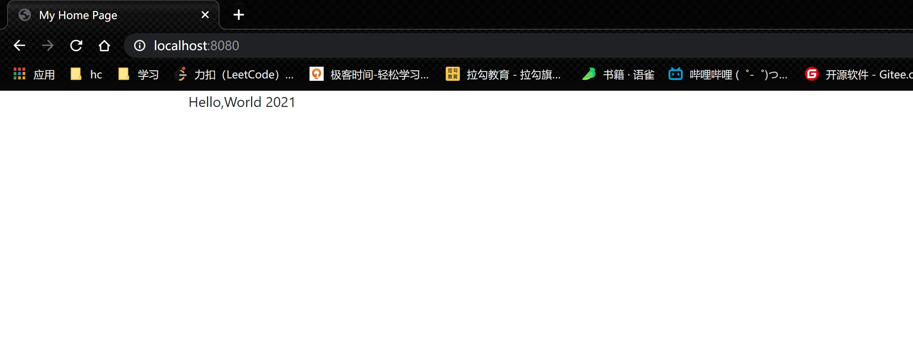
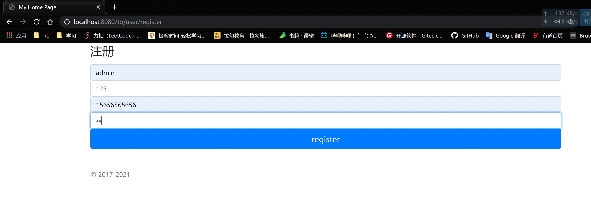
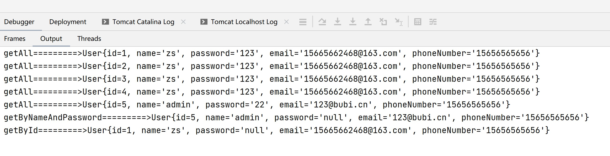
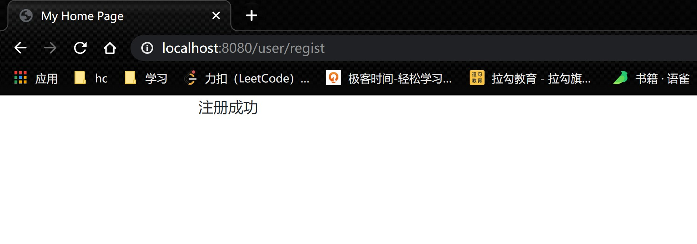

# 第一阶段：

- 编译命令：mvn clean package -U
- 启动命令：java -jar user-web/target/user-web-v1-SNAPSHOT-war-exec.jar

## [Apache Derby](http://db.apache.org/derby/)

- [一款基于 Java 的嵌入式关系型数据库](https://blog.csdn.net/horses/article/details/108330219)
- https://netbeans.org/kb/docs/ide/java-db_zh_CN.html

## 完成结果：

- 1：[《01-IDEA部署Tomcat应用》](https://www.yuque.com/docs/share/f1639b0c-190b-4bec-87ab-55be80f897cd?)

- 2：首页：http://localhost:8080/
  

- 3：注册页面：http://localhost:8080/to/user/register
  

- 4：注册-接口同步测试其他查询方法：http://localhost:8080/to/user/register
  

- 5：注册-成功跳转页：http://localhost:8080/to/user/register
  

