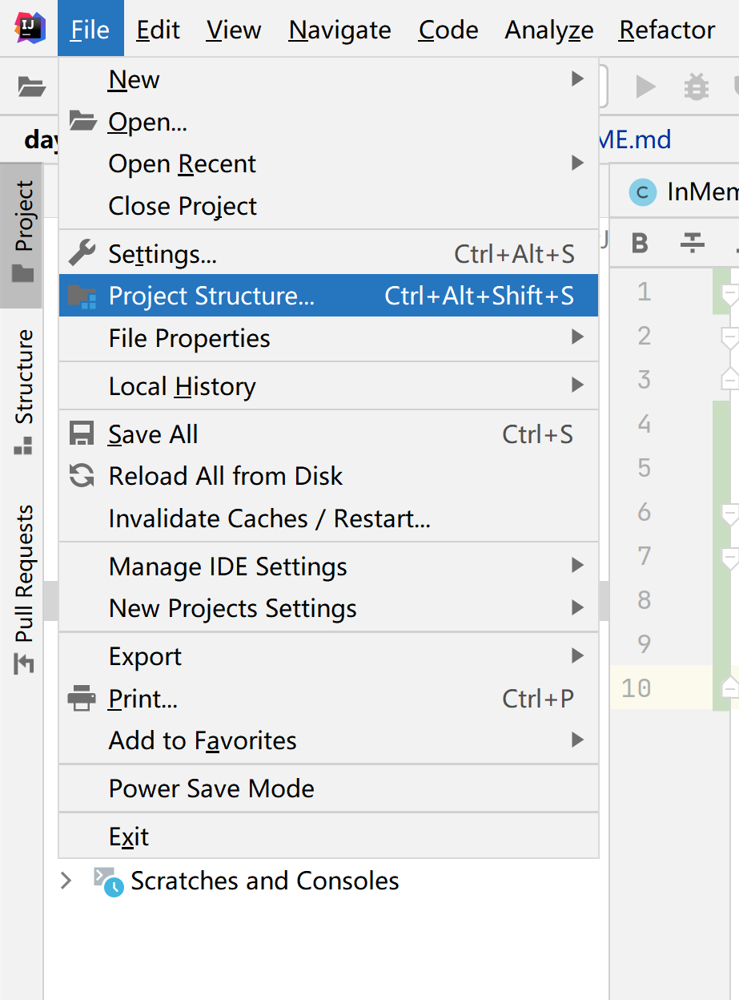

# 第一阶段：

- 编译命令：mvn clean package -U
- 启动命令：java -jar user-web/target/user-web-v1-SNAPSHOT-war-exec.jar

## [Apache Derby](http://db.apache.org/derby/)
- [一款基于 Java 的嵌入式关系型数据库](https://blog.csdn.net/horses/article/details/108330219)

- https://netbeans.org/kb/docs/ide/java-db_zh_CN.html

## IDEA 部署 spring 项目 到 tomcat

### 1：配置 项目

